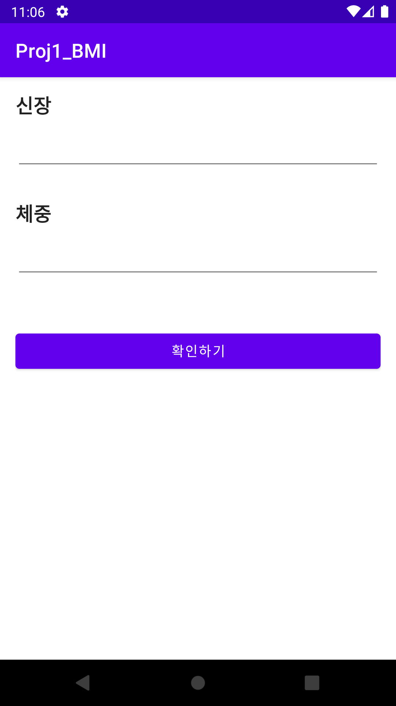
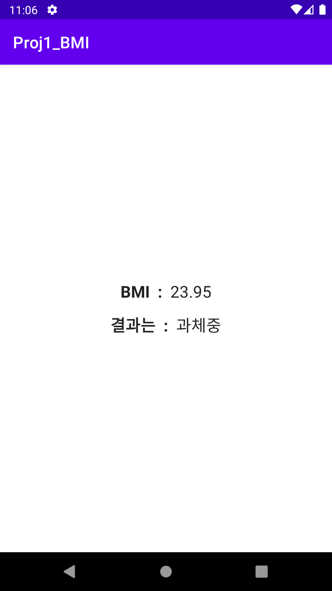

# Android Clone Coding Project #1 - BMI 계산기

# 결과화면

# 배운내용 정리

- **Layout** 을 그리는 법
  - **LinearLayout** 사용하기
  - **TextView** 의 속성들과 사용하는 법
  - **EditText** 의 속성들과 사용하는 법
  - **Button** 사용하는 법
- **Layout** 과 **Kotlin** 코드를 함께 사용하기
- **버그** 수정해보기
- **Activity** 에 대해 알아보기

### Kotlin 문법

when 분기문

람다함수
